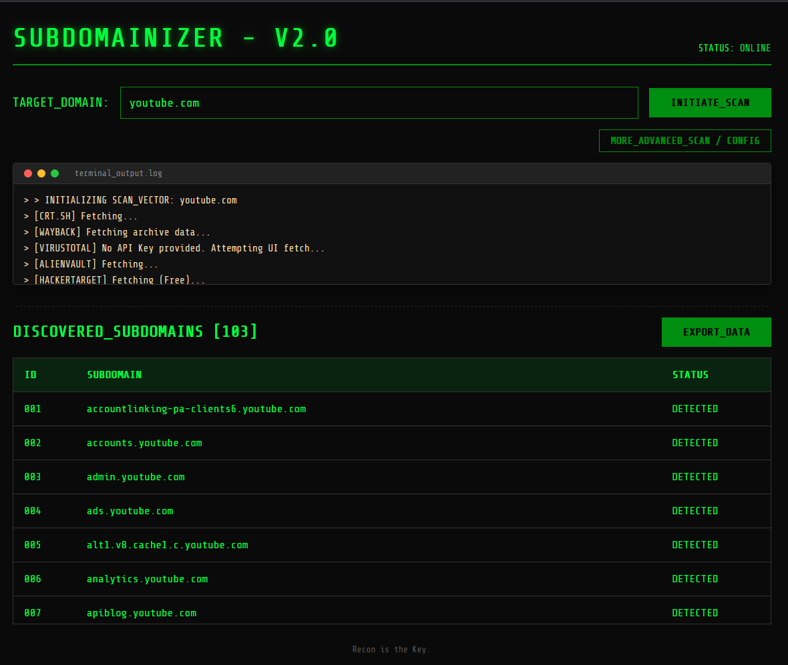
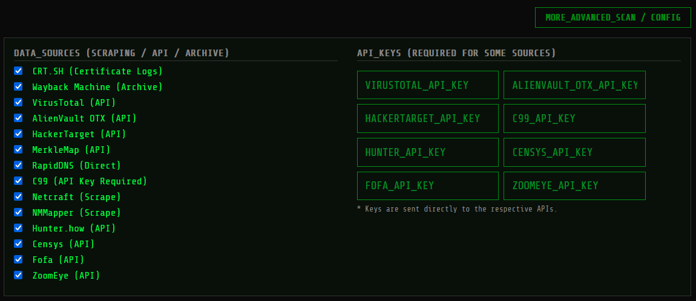

# SUBDOMAINIZER - V2.0 🌐

A lightweight, extremely fast, and completely **client-side** subdomain enumeration tool built for security researchers and bug bounty hunters. 

Unlike traditional python/go recon scripts, Subdomainizer runs entirely in your browser using Vanilla JavaScript. It aggregates OSINT data from over 14 different sources, automatically removes duplicates, and lets you export your target scope to CSV in seconds.

---

### ✨ Key Features

* **Zero Infrastructure:** Runs purely in the browser. No backend server, no database, no complex installation required.
* **14+ OSINT Sources:**
  * **Free & Scraping APIs:** CRT.SH, Wayback Machine, MerkleMap, Netcraft, NMMapper.
  * **API Integrations:** HackerTarget, AlienVault OTX, VirusTotal, C99, Hunter.how, Censys, FOFA, ZoomEye.
  * **Manual Fallbacks:** Direct links for highly protected sources (like RapidDNS).
* **API Key Management:** Easily plug in your own API keys for premium sources via the advanced configuration panel. Keys are sent directly from your browser to the respective APIs without middle-men.
* **Smart Filtering:** Automatically normalizes results and removes duplicate subdomains using native JavaScript `Set`.
* **CORS Bypassing:** Utilizes `corsproxy.io` to fetch data from sources that typically block browser cross-origin requests.
* **Data Export:** One-click export of discovered subdomains to a formatted `.csv` file for easy import into other tools (like httpx, nuclei).
* **Hacker Aesthetic:** Clean, terminal-inspired dark mode UI with interactive logs.

**Start Scanning -> ** [https://subdomainizer.vercel.app/](https://subdomainizer.vercel.app/)
---




### 🚀 Usage Guide

1. Clone the repository or simply download the files:
   ```bash
   git clone https://github.com/Karlos-5160/Subdomainizer.git
   cd Subdomainizer
   ```
2. Open `index.html` in any modern web browser (Chrome, Firefox, Edge, Safari).
3. Enter your target domain in the **TARGET_DOMAIN** field (e.g., `example.com`).
4. *(Optional)* Click on **MORE_ADVANCED_SCAN / CONFIG** to toggle the configuration panel. Here you can:
   - Select or deselect specific data sources.
   - Enter your personal API keys for premium sources (VirusTotal, AlienVault, Censys, etc.) to get more comprehensive results.
5. Click **INITIATE_SCAN**.
6. Watch the real-time terminal output to see which sources are successfully fetched.
7. Once the scan is complete, view the unique subdomains in the results table, and click **EXPORT_DATA** to download them as a CSV file.

---

### 🛠️ Architecture and Tech Stack

Because this tool is entirely client-side, it is developed using:
- **HTML5:** Semantic structure with hidden configuration panels and dynamic data tables.
- **Vanilla CSS:** Custom dark-themed styles (`style.css`), glowing text animations, and terminal-inspired UI components (`Share Tech Mono` font).
- **Vanilla JavaScript:** All API fetching, asynchronous `Promise.allSettled` handling, deduplication logic, UI state toggles, and CSV blob generation is contained in `app.js`.

---

### ⚠️ Important Notes and Limitations

- **Browser Limits & CORS:** Some APIs block cross-origin requests. Subdomainizer intelligently relies on `corsproxy.io` as a proxy for scraping certain endpoints (like Netcraft).
- **Anti-Bot Protection:** If a source like RapidDNS has strict Cloudflare or reCAPTCHA protections that block automated proxy requests, Subdomainizer will gracefully fail and provide a manual link to visit the site directly instead.
- **Rate Limiting:** Free APIs such as HackerTarget or VirusTotal (without an API key) have strict rate limits. If a fetch fails due to rate limits, you may have to wait before querying them again, or use an API key for higher quotas.

---

### 🤝 Contributing

Contributions, issues, and feature requests are welcome! Feel free to check the [issues page](https://github.com/Karlos-5160/Subdomainizer/issues) if you want to contribute.

### 📜 License

This project is licensed under the MIT License - see the [LICENSE](LICENSE) file for details.
